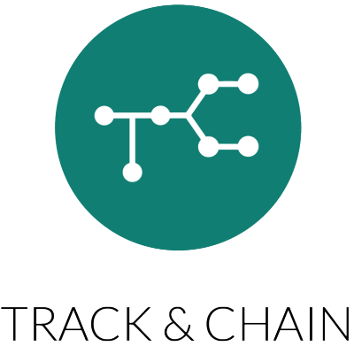

# Dashboard 

_Single Page Application created with React. The app, is a simple and responsive dashboard without functionality, created as a challenge for Track and Chain_

## Project Structure 📄

```
/
`-_src
    |-components
        |-App
          |-Header
          |-Main
            |-LineGraph
            |-DoughnutGraph
            |-BarGraph
            |-PieGraph
            |-Location
          |-Footer
    |-images
    |-stylesheets
```

## Starting 🚀

_These instructions will allow you to obtain a copy of the project on your local machine for development and testing purposes._

1. You need to install [Node 10.16.0 & npm 6.9.0](https://nodejs.org/es/download/).

2. Clone the repository: `$ git clone https://github.com/cterrasid/trackandchain__dashboard/`. You can also Fork the project so you'll have it on your GitHub profile.

3. Install dependencies with `$ npm install`.

4. To launch the project and see it in the browser, run `$ npm start`.


## Built with 🛠️

- [create-react-app](https://create-react-app.dev/docs/getting-started/)
- [react-chartjs-2 2.7.6](https://www.npmjs.com/package/react-chartjs-2)

## Author ✒️

- Clarette Terrasi Díaz - [Go to my portfolio](https://cterrasid.github.io/my-portfolio/)
